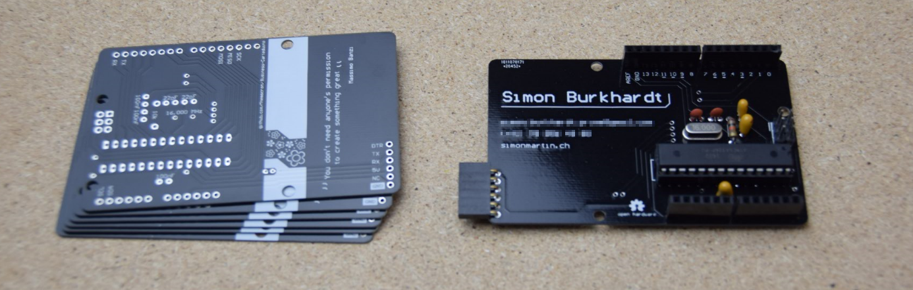
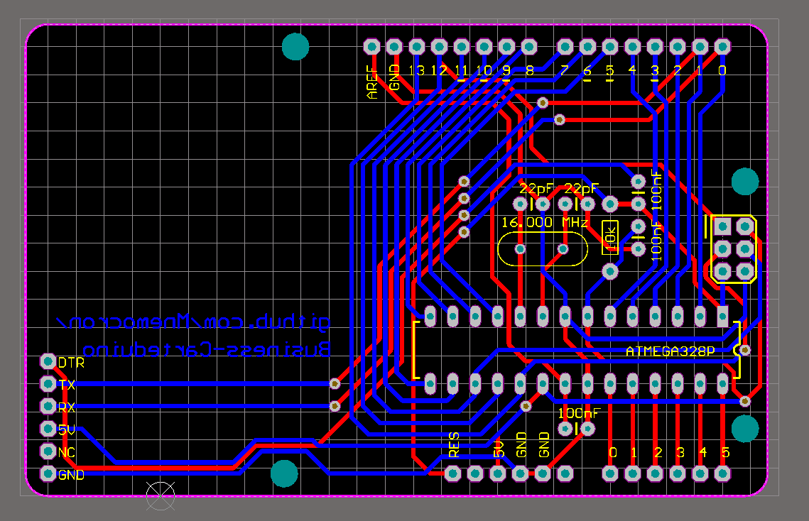

# Business-Carteduino
The business card that is also an Arduino compatible.

## Partlist

| Pcs. | Part | Value |
|:-----|:-----|:------|
| 1 | ATmega 328 P (w/ Arduino bootloader) | |
| 1 | Crystal Oscillator | 16MHz |
| 2 | Capacitor | 22p |
| 3 | Capacitor | 100n |
| 1 | Resistor | 10k |
| 1 | Header Pins (male)   | 2x3 |
| 2 | Header Pins (female) | 1x6 |
| 2 | Header Pins (female) | 1x8 |
| 1 | Header Pins | 1x6 |

## Screenshots

